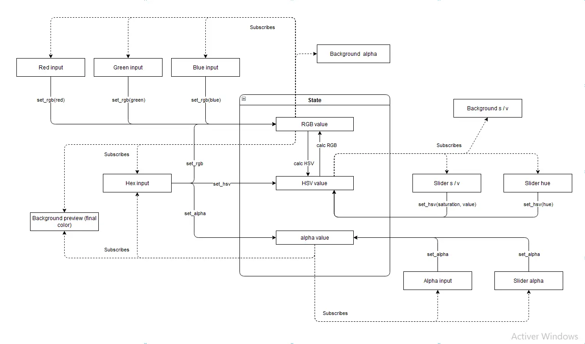

# HSV Color Picker

Simple HSV color picker in HTML.

- Setup :

    - Run `npm i`.
    - Run `npm build`.
    - Execute `dist/index.html` in the browser.

#
### State & Interactions

The following graph modelizes the component's state management system.
 
All state variables are shown with their subscriptions and all actions towards a change in the state.

